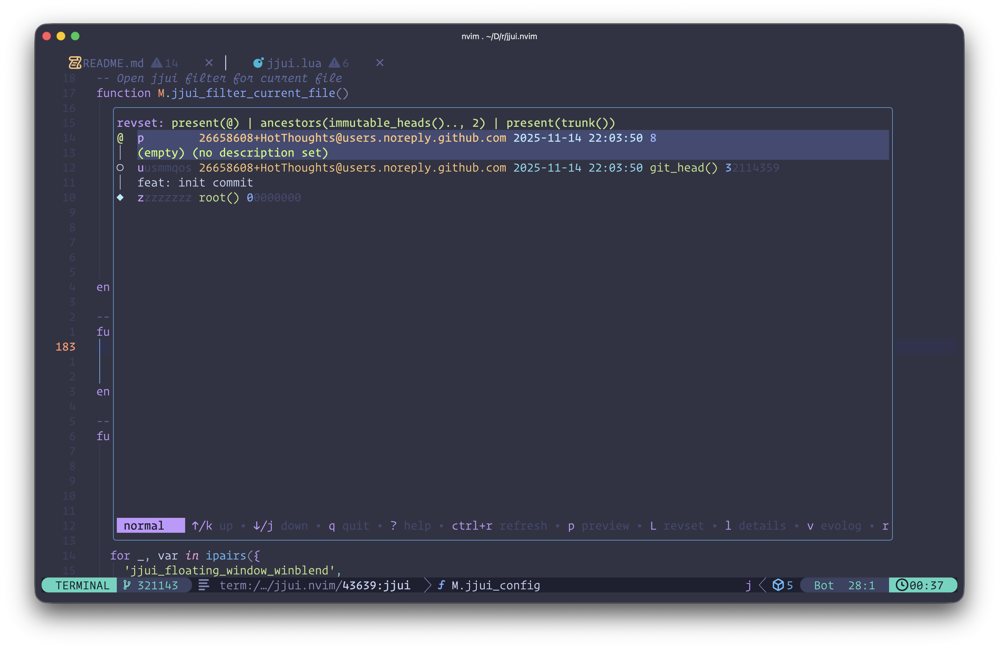

# jjui.nvim

A Neovim plugin for integrating [jjui](https://github.com/idursun/jjui) - a terminal UI for the Jujutsu (jj) version control system. Similar to [lazygit.nvim](https://github.com/kdheepak/lazygit.nvim), but for jj/jjui.




## ✨ Features

- 🚀 Toggle jjui with a single keymap (default: `<leader>jj`)
- 🪟 Beautiful floating window with customizable borders
- 📁 Open jjui for the current file's repository
- 🔍 Filter commits for project or current file
- ⚙️ Direct access to jjui configuration
- 💻 LazyVim compatible
- 🎨 Customizable window appearance and behavior
- 🔄 [plenary.nvim](https://github.com/nvim-lua/plenary.nvim) integration for enhanced window management

## 📋 Requirements

- Neovim >= 0.8.0
- [jjui](https://github.com/idursun/jjui) installed and in your PATH
- [jj](https://github.com/martinvonz/jj) version control system
- [plenary.nvim](https://github.com/nvim-lua/plenary.nvim) - Required dependency

## 📦 Installation

### Using [lazy.nvim](https://github.com/folke/lazy.nvim) (Recommended for LazyVim)

```lua
{
  "HotThoughts/jjui.nvim",
  dependencies = {
    "nvim-lua/plenary.nvim", -- required
  },
  cmd = {
    "JJUI",
    "JJUICurrentFile",
    "JJUIFilter",
    "JJUIFilterCurrentFile",
    "JJConfig",
  },
  -- Setting the keybinding here helps lazy-loading
  keys = {
    { "<leader>jj", "<cmd>JJUI<cr>", desc = "JJUI" },
    { "<leader>jc", "<cmd>JJUICurrentFile<cr>", desc = "JJUI (current file)" },
    { "<leader>jl", "<cmd>JJUIFilter<cr>", desc = "JJUI Log" },
    { "<leader>jf", "<cmd>JJUIFilterCurrentFile<cr>", desc = "JJUI Log (current file)" },
  },
  config = function()
    require("jjui").setup({
      -- configuration options (see below)
    })
  end,
}
```

### Using [packer.nvim](https://github.com/wbthomason/packer.nvim)

```lua
use {
  'HotThoughts/jjui.nvim',
  requires = {
    'nvim-lua/plenary.nvim',
  },
  config = function()
    require('jjui').setup()
  end
}
```

### Using [vim-plug](https://github.com/junegunn/vim-plug)

```vim
Plug 'nvim-lua/plenary.nvim'
Plug 'HotThoughts/jjui.nvim'
```

## ⚙️ Configuration

### Default Configuration

```lua
require('jjui').setup({
  -- Window appearance
  floating_window_winblend = 0, -- transparency (0=solid, 100=invisible)
  floating_window_scaling_factor = 0.85, -- floating window size (0.85 = 85% of screen)
  floating_window_border = 'rounded', -- border style: 'rounded', 'single', 'double', 'solid', etc.

  -- Integration settings
  use_neovim_remote = 1, -- use neovim-remote if available

  -- Custom config
  use_custom_config_file_path = 0, -- use custom config file
  config_file_path = '', -- path to custom config file (or table of paths)

  -- Callbacks
  on_exit_callback = nil, -- function to call when jjui exits
})
```

### Vim Configuration Variables

You can also configure using vim variables:

```vim
let g:jjui_floating_window_winblend = 0
let g:jjui_floating_window_scaling_factor = 0.85
let g:jjui_floating_window_border = 'rounded'
let g:jjui_use_neovim_remote = 1
let g:jjui_use_custom_config_file_path = 0
let g:jjui_config_file_path = ''
```

## 🎮 Usage

### Commands

- `:JJUI` - Toggle jjui in a floating window
- `:JJUICurrentFile` - Open jjui for the current file's repository
- `:JJUIFilter` - Open jjui with the log view
- `:JJUIFilterCurrentFile` - Open jjui log for the current file
- `:JJConfig` - Open jjui configuration file

### Default Keymaps

The plugin provides `<Plug>` mappings that you can use to create your own keymaps:

```vim
nmap <leader>jj <Plug>(JJUI)
nmap <leader>jc <Plug>(JJUICurrentFile)
nmap <leader>jl <Plug>(JJUIFilter)
nmap <leader>jf <Plug>(JJUIFilterCurrentFile)
nmap <leader>jg <Plug>(JJConfig)
```

By default, `<leader>jj` is mapped to toggle jjui if no other mapping exists.

## 🎨 Window Appearance Customization

### Border Styles

You can customize the border appearance. Here are some popular options:

```lua
-- Rounded corners (default - smooth and pretty)
floating_window_border = 'rounded'

-- Simple single-line border (minimal)
floating_window_border = 'single'

-- Double-line border (bold)
floating_window_border = 'double'

-- Solid border
floating_window_border = 'solid'

-- Custom border characters (advanced)
floating_window_border = { '╭', '─', '╮', '│', '╯', '─', '╰', '│' }
floating_window_border_chars = { '╔', '═', '╗', '║', '╝', '═', '╚', '║' }

-- Minimal border (dots)
floating_window_border_chars = { '.', ' ', '.', ' ', '.', ' ', '.', ' ' }

-- No border
floating_window_border_chars = { ' ', ' ', ' ', ' ', ' ', ' ', ' ', ' ' }

-- Or use built-in styles (neovim 0.9+)
-- In your config, use border = "single", "double", "rounded", "solid", or "shadow"
```

### Window Size Presets

```lua
-- Medium (recommended)
floating_window_scaling_factor = 0.85  -- 85% of screen

-- Compact
floating_window_scaling_factor = 0.75  -- 75% of screen

-- Large
floating_window_scaling_factor = 0.95  -- 95% of screen

-- Small
floating_window_scaling_factor = 0.6   -- 60% of screen
```

### Transparency

```lua
-- Subtle transparency (default - polished look)
floating_window_winblend = 5

-- No transparency (solid)
floating_window_winblend = 0

-- More transparency
floating_window_winblend = 10

-- More transparent
floating_window_winblend = 20
```

## 🔧 Advanced Configuration

### Using neovim-remote

To edit commit messages inside the same Neovim instance:

1. Install neovim-remote:
   ```bash
   pip install neovim-remote
   ```

2. Add to your shell configuration (`~/.bashrc` or `~/.zshrc`):
   ```bash
   if [ -n "$NVIM_LISTEN_ADDRESS" ]; then
       alias nvim=nvr -cc split --remote-wait +'set bufhidden=wipe'
       export VISUAL="nvr -cc split --remote-wait +'set bufhidden=wipe'"
       export EDITOR="nvr -cc split --remote-wait +'set bufhidden=wipe'"
   else
       export VISUAL="nvim"
       export EDITOR="nvim"
   fi
   ```

3. Add to your Neovim configuration:
   ```vim
   if has('nvim') && executable('nvr')
     let $GIT_EDITOR = "nvr -cc split --remote-wait +'set bufhidden=wipe'"
   endif
   ```

### Using nvim server (without neovim-remote)

1. Start Neovim with a server:
   ```bash
   alias vim='nvim --listen /tmp/nvim-server.pipe'
   ```

2. Configure jjui to use the server (in `~/.config/jjui/config.toml`):
   ```toml
   [ui]
   editor = "nvim --server /tmp/nvim-server.pipe --remote-tab"
   ```

### Auto-tracking Repositories

To automatically track all jj repositories you visit:

```lua
vim.api.nvim_create_autocmd("BufEnter", {
  callback = function()
    require('jjui.utils').project_root_dir()
  end,
})
```

### Custom Exit Callback

```lua
require('jjui').setup({
  on_exit_callback = function()
    -- Refresh file explorer, status line, etc.
    vim.cmd('NvimTreeRefresh')
  end,
})
```

## 🎨 Highlighting

The plugin defines the following highlight groups that you can customize:

| Highlight Group | Default | Description |
|----------------|---------|-------------|
| `JjuiFloat` | Links to `Normal` | Floating window background (matches your theme) |
| `JjuiBorder` | Links to `FloatBorder` | Floating window border |

The background matches your theme's `Normal` highlight by default. Combined with 5% `winblend`, this creates a subtle semi-transparent effect.

Example customizations:

```lua
-- Transparent background
vim.api.nvim_set_hl(0, 'JjuiFloat', { bg = 'NONE' })

-- Custom solid color
vim.api.nvim_set_hl(0, 'JjuiFloat', { bg = '#1e1e2e', fg = '#cdd6f4' })

-- Colored border
vim.api.nvim_set_hl(0, 'JjuiBorder', { fg = '#89b4fa' })

-- Match specific highlight group
vim.api.nvim_set_hl(0, 'JjuiFloat', { link = 'NormalFloat' })
```

## 🤝 Contributing

Contributions are welcome! Please feel free to submit issues and pull requests.

### Development Setup

This project uses pre-commit hooks for code quality.

Quick start:
```bash
# Install tools via Homebrew
brew install pre-commit stylua luacheck

# Install pre-commit hooks
pre-commit install

# Run checks
pre-commit run --all-files
```

## 📄 License

MIT License - see [LICENSE](LICENSE) file for details.

## 🙏 Acknowledgments

- Inspired by [lazygit.nvim](https://github.com/kdheepak/lazygit.nvim)
- Built for [jjui](https://github.com/idursun/jjui) and [jj](https://github.com/martinvonz/jj)
- Thanks to the Neovim community

## 🐛 Troubleshooting

### jjui command not found

Make sure jjui is installed and in your PATH:
```bash
# Check if jjui is available
which jjui

# Install jjui (example using cargo)
cargo install jjui
```

### Floating window not appearing

1. Check Neovim version: `nvim --version` (requires >= 0.8.0)
2. Try disabling plenary integration:
   ```lua
   require('jjui').setup({
     floating_window_use_plenary = 0,
   })
   ```

### Repository not detected

Ensure you're in a jj or git repository. The plugin looks for `.jj` or `.git` directories.
