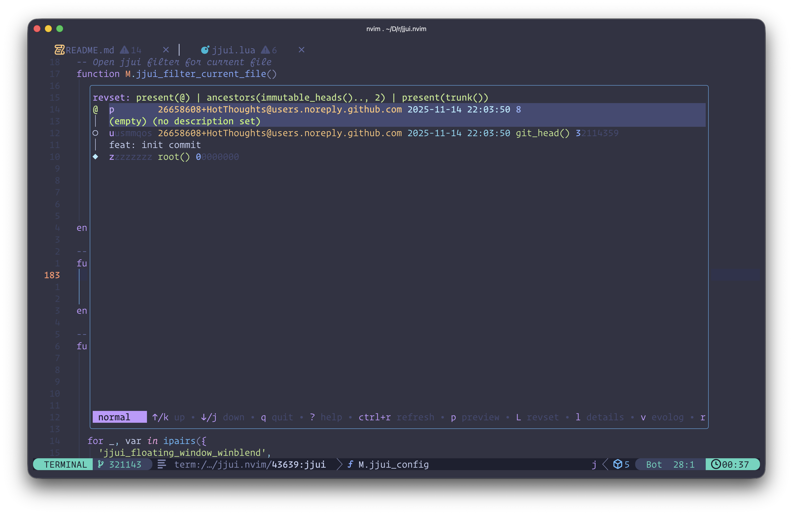

# jjui.nvim

A Neovim plugin that opens [jjui](https://github.com/idursun/jjui) in a floating terminal.
If you have used [lazygit.nvim](https://github.com/kdheepak/lazygit.nvim), this is the same idea for `jj`.




## Features

- Toggle `jjui` from Neovim (default keymap: `<leader>jj`)
- Open `jjui` for the current file's repository
- Open filtered history views (`:JJUIFilter`, `:JJUIFilterCurrentFile`)
- Edit `jjui` config quickly with `:JJConfig`
- Configure floating window size, border, and transparency
- Works fine with LazyVim and plain Neovim setups

## Requirements

- Neovim 0.8+
- [`jj`](https://github.com/martinvonz/jj)
- [`jjui`](https://github.com/idursun/jjui) in `PATH`

## Installation

### lazy.nvim

```lua
{
  "HotThoughts/jjui.nvim",
  cmd = {
    "JJUI",
    "JJUICurrentFile",
    "JJUIFilter",
    "JJUIFilterCurrentFile",
    "JJConfig",
  },
  keys = {
    { "<leader>jj", "<cmd>JJUI<cr>", desc = "JJUI" },
    { "<leader>jc", "<cmd>JJUICurrentFile<cr>", desc = "JJUI (current file)" },
    { "<leader>jl", "<cmd>JJUIFilter<cr>", desc = "JJUI log" },
    { "<leader>jf", "<cmd>JJUIFilterCurrentFile<cr>", desc = "JJUI log (current file)" },
  },
  config = function()
    require("jjui").setup()
  end,
}
```

### packer.nvim

```lua
use {
  "HotThoughts/jjui.nvim",
  config = function()
    require("jjui").setup()
  end,
}
```

### vim-plug

```vim
Plug 'HotThoughts/jjui.nvim'
```

## Configuration

```lua
require("jjui").setup({
  floating_window_winblend = 0,
  floating_window_scaling_factor = 0.85,
  floating_window_border = "rounded",
  use_neovim_remote = 1,
  use_custom_config_file_path = 0,
  config_file_path = "",
  on_exit_callback = nil,
})
```

You can also use `vim.g` variables:

```vim
let g:jjui_floating_window_winblend = 0
let g:jjui_floating_window_scaling_factor = 0.85
let g:jjui_floating_window_border = 'rounded'
let g:jjui_use_neovim_remote = 1
let g:jjui_use_custom_config_file_path = 0
let g:jjui_config_file_path = ''
let g:jjui_on_exit_callback = v:null
```

## Usage

Commands:

- `:JJUI` toggle `jjui` in a floating window
- `:JJUICurrentFile` open `jjui` for the current file's repository
- `:JJUIFilter` open `jjui -n 100`
- `:JJUIFilterCurrentFile` open `jjui` filtered by current file
- `:JJConfig` open `~/.config/jjui/config.toml`

`<Plug>` mappings provided by the plugin:

```vim
nmap <leader>jj <Plug>(JJUI)
nmap <leader>jc <Plug>(JJUICurrentFile)
nmap <leader>jl <Plug>(JJUIFilter)
nmap <leader>jf <Plug>(JJUIFilterCurrentFile)
nmap <leader>jg <Plug>(JJConfig)
```

If `<leader>jj` is not mapped, the plugin sets it to `<Plug>(JJUI)`.

## Appearance

Common border options:

```lua
floating_window_border = "rounded"
floating_window_border = "single"
floating_window_border = "double"
floating_window_border = "solid"
```

Window size examples:

```lua
floating_window_scaling_factor = 0.75
floating_window_scaling_factor = 0.85
floating_window_scaling_factor = 0.95
```

Transparency examples:

```lua
floating_window_winblend = 0
floating_window_winblend = 10
floating_window_winblend = 20
```

Highlight groups:

| Group | Default |
|---|---|
| `JjuiFloat` | linked to `Normal` background |
| `JjuiBorder` | linked to `FloatBorder` |

Example highlight overrides:

```lua
vim.api.nvim_set_hl(0, "JjuiFloat", { bg = "NONE" })
vim.api.nvim_set_hl(0, "JjuiBorder", { fg = "#89b4fa" })
```

## neovim-remote setup (optional)

`nvr` is optional, but useful for commit message editing inside your current Neovim session.

Install:

```bash
pip install neovim-remote
```

Shell setup (`~/.bashrc` or `~/.zshrc`):

```bash
if [ -n "$NVIM_LISTEN_ADDRESS" ]; then
  alias nvim="nvr -cc split --remote-wait +'set bufhidden=wipe'"
  export VISUAL="nvr -cc split --remote-wait +'set bufhidden=wipe'"
  export EDITOR="nvr -cc split --remote-wait +'set bufhidden=wipe'"
else
  export VISUAL="nvim"
  export EDITOR="nvim"
fi
```

## Contributing

PRs and issues are welcome.

```bash
brew install pre-commit stylua luacheck
pre-commit install
pre-commit run --all-files
```

## Troubleshooting

### `jjui` command not found

```bash
which jjui
cargo install jjui
```

### Floating window does not open

- Check Neovim version with `nvim --version` (needs 0.8+)
- Check `jjui` and `jj` are available in `PATH`

### Repository not detected

Run the command inside a `jj` or `git` repository. The plugin looks for `.jj` or `.git`.

## License

MIT. See [`LICENSE`](LICENSE).
